<!-- HERO -->
<picture>
  <source media="(prefers-color-scheme: dark)" srcset="./assets/hero-pro-dark.svg">
  
</picture>

  <a href="https://muhammadabdullah227.co.uk">
    <picture>
      <source media="(prefers-color-scheme: dark)" srcset="https://img.shields.io/website?down_message=offline&label=muhammadabdullah227.co.uk&style=for-the-badge&up_message=online&url=https%3A%2F%2Fmuhammadabdullah227.co.uk&labelColor=0B1220&color=111827">
      
    </picture>
  </a>

<!-- Social row (centered) -->

  <!-- LinkedIn -->
  <a href="https://linkedin.com/in/muhammad-abdullah227">
    <picture>
      <source media="(prefers-color-scheme: dark)" srcset="https://img.shields.io/badge/LinkedIn-111827?logo=linkedin&logoColor=0A66C2&labelColor=0B1220">
      
    </picture>
  </a>
&nbsp;&nbsp;
  <a href="https://github.com/MA1002643">
    <picture>
      <source media="(prefers-color-scheme: dark)" srcset="https://img.shields.io/badge/GitHub-111827?logo=github&logoColor=E5E7EB&labelColor=0B1220">
      
    </picture>
  </a>

<!-- Metrics row (centered, matches social colors, keeps live count) -->

  <!-- Profile views (count from Komarev via Shields dynamic) -->
  <picture>
    <source media="(prefers-color-scheme: dark)" srcset="https://img.shields.io/badge/dynamic/xml?label=Profile%20views&style=flat&labelColor=0B1220&color=111827&query=%2F%2F*%5Blocal-name()%3D'text'%5D%5Blast()%5D&url=https%3A%2F%2Fkomarev.com%2Fghpvc%2F%3Fusername%3DMA1002643">
    
  </picture>
&nbsp;&nbsp;
  <picture>
    <source media="(prefers-color-scheme: dark)" srcset="https://img.shields.io/github/followers/MA1002643?label=Followers&style=flat&labelColor=0B1220&color=111827">
    
  </picture>

<!-- Animated underline under socials -->

  <picture>
    <source media="(prefers-color-scheme: dark)" srcset="./assets/social-underline-dark.svg">
    
  </picture>

<!-- Typing headline (theme-aware colors) -->

  <picture>
    <!-- Dark mode: light text -->
    <source media="(prefers-color-scheme: dark)" srcset="https://readme-typing-svg.demolab.com?font=Fira+Code&size=22&duration=2800&pause=600&center=true&vCenter=true&width=900&color=E5E7EB&lines=Building+polished+experiences+for+web%2C+mobile+%26+cloud;Obsessed+with+clean+architecture%2C+CI%2FCD%2C+and+DX;Let%E2%80%99s+ship+something+people+love+%F0%9F%9A%80">
    <!-- Light mode: dark text -->
    
  </picture>

---

<!-- PINNED: START -->
<h3 align="center" style="margin:0 0 12px; color:#FF652F; font-weight:800;">📌 Pinned Repositories</h3>
<table align="center" cellspacing="0" cellpadding="0" border="0" style="border:0; border-collapse:separate; margin:0 auto;">
<tr>
<td align="center" valign="top" width="50%" style="padding:12px 24px 12px 0px; border:0;">
<a href="https://github.com/MA1002643/jokes-app">

<picture>
<source media="(prefers-color-scheme: dark)" srcset="https://github-readme-stats.vercel.app/api/pin/?username=MA1002643&repo=jokes-app&show_owner=false&hide_border=true&title_color=ff652f&icon_color=FFE400&cache_seconds=21600&text_color=ffffff&bg_color=0D1117">

</picture>

</a>
</td>
<td align="center" valign="top" width="50%" style="padding:12px 0px 12px 24px; border:0;">
<a href="https://github.com/MA1002643/Article-Server">

<picture>
<source media="(prefers-color-scheme: dark)" srcset="https://github-readme-stats.vercel.app/api/pin/?username=MA1002643&repo=Article-Server&show_owner=false&hide_border=true&title_color=ff652f&icon_color=FFE400&cache_seconds=21600&text_color=ffffff&bg_color=0D1117">

</picture>

</a>
</td>
</tr>
</table>
<!-- PINNED: END -->

---

### 🚀 What I’m About

- 🌱 Always learning (and shipping) — web, mobile, cloud.
- 🤝 Open to collabs with juniors & seniors alike.
- 🎯 **2025 Goal:** contribute more to open-source, ship impactful tools.
- ✈️ Fun fact: I love driving HGVs and I’d love to become a pilot one day.

---

### 🧰 Tech I Use

<!-- Manual icons (you control these) -->

  <picture>
    <source media="(prefers-color-scheme: dark)" srcset="https://skillicons.dev/icons?i=next,react,ts,js,tailwind,nodejs,express,mongodb,mysql,git,githubactions,vercel,dotnet,aws&perline=14&theme=dark">
    
  </picture>

<!-- Auto-generated between markers by the workflow (DO NOT EDIT) -->
<!--TECH:START-->
<!--TECH:END-->

---

### 📈 GitHub Pulse

  <picture>
    <!-- Dark mode -->
    <source
      media="(prefers-color-scheme: dark)"
      srcset="https://github-readme-stats-chi-woad.vercel.app/api?username=MA1002643&show_icons=true&hide_border=false&title_color=ff652f&icon_color=FFE400&bg_color=0D1117&text_color=ffffff&border_color=30363D&cache_seconds=7200" />
    <!-- Light mode (fallback) -->
    
  </picture>

  <picture>
    <source media="(prefers-color-scheme: dark)" srcset="https://streak-stats.demolab.com?user=MA1002643&hide_border=false&fire=FF652F&ring=FF652F&currStreakNum=FFE400&currStreakLabel=FFE400&background=0D1117&stroke=30363D">
    
  </picture>

  <picture>
    <source media="(prefers-color-scheme: dark)" srcset="https://github-readme-activity-graph.vercel.app/graph?username=MA1002643&theme=react-dark&hide_title=true&area=true">
    
  </picture>

---

### 🧪 Featured Projects

> Want a collab? Open an issue or DM on LinkedIn — I’m always up for building something bold.

- **Afaaq Mobile** — Full-stack for a small business (Next.js, Node/Express, MongoDB, CI/CD).
- **SmartMeal / NutriTimer** — .NET MAUI apps (barcode nutrition, hydration/meal reminders).
- **Portfolio** — Animations & 3D touches: <a href="https://muhammadabdullah227.co.uk/">muhammadabdullah227.co.uk</a>

---

### ⚡ Recent GitHub Activity

<!--RECENT_ACTIVITY:start-->
1. ⬆️ Pushed 1 commit(s) to [MA1002643/MA1002643](https://github.com/MA1002643/MA1002643) 
2. ⬆️ Pushed 1 commit(s) to [MA1002643/MA1002643](https://github.com/MA1002643/MA1002643) 
3. ⬆️ Pushed 1 commit(s) to [MA1002643/MA1002643](https://github.com/MA1002643/MA1002643) 
4. ⬆️ Pushed 1 commit(s) to [MA1002643/MA1002643](https://github.com/MA1002643/MA1002643) 
5. ⬆️ Pushed 1 commit(s) to [MA1002643/MA1002643](https://github.com/MA1002643/MA1002643) 
<!--RECENT_ACTIVITY:end-->

<!--RECENT_ACTIVITY:last_update-->
Last Updated: Tuesday, September 16th, 2025, 8:34:33 PM
<!--RECENT_ACTIVITY:last_update_end-->

---

  

  <a href="https://muhammadabdullah227.co.uk">Website</a> •
  <a href="https://linkedin.com/in/muhammad-abdullah227">LinkedIn</a> •
  <a href="https://github.com/MA1002643">GitHub</a>

