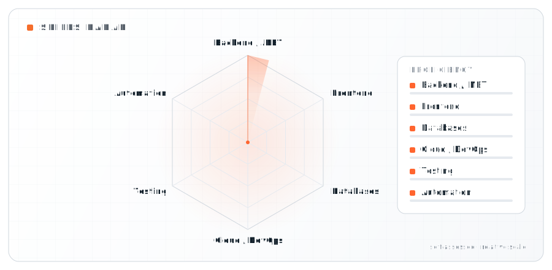

<!-- ════════════════════════════════════════════════════════════════════════
     MUHAMMAD ABDULLAH · github.com/MA1002643 · profile README
     "Engineering Mission-Control" — bespoke animated SVGs live in /assets
     ⚠ Auto-maintained blocks (DO NOT remove the marker comments):
        PINNED · RECENT_ACTIVITY · LANG-TIME
═════════════════════════════════════════════════════════════════════════ -->

<!-- ═══════════════════════════ HERO ═══════════════════════════ -->
<a href="https://ma.codes/"><picture><source media="(prefers-color-scheme: dark)" srcset="./assets/hero-pro-dark.svg"></picture></a>

<!-- ═══════════════════════ IDENTITY / CONTACT ═══════════════════════ -->
<p align="center">
  <a href="mailto:muhammad.abdullah33176444@gmail.com"></a>
  <a href="https://linkedin.com/in/muhammad-abdullah227" target="_blank"></a>
  <a href="https://ma.codes/" target="_blank"></a>
  <a href="https://developers.google.com/profile/u/117687534681375612751" target="_blank"></a>
  <a href="https://wakatime.com/@c6d912e0-7fef-41da-8c0e-1df782a8dd33" target="_blank"></a>
</p>
<p align="center">
  
  <a href="https://github.com/MA1002643?tab=repositories&sort=stargazers"></a>
  <a href="https://github.com/MA1002643?tab=followers"></a>
  
</p>

<!-- ═══════════════════════ TYPING HEADLINE ═══════════════════════ -->
<p align="center">
  <picture>
    <source media="(prefers-color-scheme: dark)" srcset="https://readme-typing-svg.demolab.com?font=Fira+Code&size=22&duration=2800&pause=700&center=true&vCenter=true&width=900&color=E5E7EB&lines=Full-Stack+Software+Engineer+%E2%80%94+C%23%2F.NET+%C2%B7+Node+%C2%B7+Next.js;Clean+architecture%2C+CI%2FCD%2C+and+developer+experience;I+build+self-updating+systems+%26+polished+apps+%F0%9F%9A%80">
    
  </picture>
</p>

<!-- divider -->
<picture><source media="(prefers-color-scheme: dark)" srcset="./assets/divider-dark.svg"></picture>

<!-- ═══════════════════════ WHOAMI (terminal) ═══════════════════════ -->
<h2 align="center">🧑‍💻 <code>whoami</code></h2>

<picture>
  <source media="(prefers-color-scheme: dark)" srcset="./assets/terminal-card-dark.svg">
  
</picture>

<!-- ═══════════════════════ METRICS STRIP ═══════════════════════ -->
<picture>
  <source media="(prefers-color-scheme: dark)" srcset="./assets/metrics-strip-dark.svg">
  
</picture>

<!-- divider -->
<picture><source media="(prefers-color-scheme: dark)" srcset="./assets/divider-dark.svg"></picture>

<!-- ═══════════════════════ SKILLS RADAR ═══════════════════════ -->
<h2 align="center">🧭 Skills Radar</h2>

<div align="center">
  <picture>
    <source media="(prefers-color-scheme: dark)" srcset="./assets/skills-radar-dark.svg">
    
  </picture>
</div>

<h3 align="center">🧰 Core Stack</h3>

<div align="center">
<table>
  <tr>
    <td align="right" valign="top"><b>Languages</b></td>
    <td>
      
      
      
      
      
      
    </td>
  </tr>
  <tr>
    <td align="right" valign="top"><b>Frameworks &amp; Runtime</b></td>
    <td>
      
      
      
      
      
      
      
      
    </td>
  </tr>
  <tr>
    <td align="right" valign="top"><b>Data &amp; Cloud</b></td>
    <td>
      
      
      
      
      
      
      
      
    </td>
  </tr>
  <tr>
    <td align="right" valign="top"><b>Tooling &amp; CI/CD</b></td>
    <td>
      
      
      
      
      
      
    </td>
  </tr>
</table>
</div>

<!-- divider -->
<picture><source media="(prefers-color-scheme: dark)" srcset="./assets/divider-dark.svg"></picture>

<!-- ═══════════════════════ FEATURED PROJECTS ═══════════════════════ -->
<h2 align="center">🚀 Featured Project</h2>

<p align="center"><i>The one I'm most comfortable putting my name on — a full-stack recipe app with a documented REST API. My other repos are honest works in progress.</i></p>

<div align="center">
<table>
  <tr>
    <td width="620" valign="top">
      <h3 align="center">🍳 <a href="https://github.com/MA1002643/ai-powered-recipe-search-platform">Full-Stack Recipe Platform</a></h3>
      <p align="center"><sub><code>ai-powered-recipe-search-platform</code></sub></p>
      <p>A <b>Vue 3</b> single-page app backed by an <b>Express + SQLite</b> REST API — user signup &amp; login, recipe creation and browsing, and ratings, with a <b>Swagger</b>-documented API and a Mocha/Chai test suite.</p>
      <p align="center">    </p>
    </td>
  </tr>
</table>
</div>

<p align="center"><sub>Browse <a href="https://github.com/MA1002643?tab=repositories">all repositories →</a> — several are early works in progress.</sub></p>

### 📌 Most Active Repositories

<sub><i>Auto-pinned weekly by a GitHub Action, ranked by recent activity — so this always reflects what I'm building right now.</i></sub>

<!-- PINNED: START -->
<div align="center">
  <a href="https://github.com/MA1002643/theabdullahfolio"><picture><source media="(prefers-color-scheme: dark)" srcset="https://github-readme-stats-chi-woad.vercel.app/api/pin/?username=MA1002643&repo=theabdullahfolio&description_lines_count=2&hide_border=false&cache_seconds=7200&bg_color=0D1117&title_color=ff652f&icon_color=FFC857&text_color=E5E7EB&border_color=243042"></picture></a>
  <a href="https://github.com/MA1002643/article-server-full-stack-blogging-platform"><picture><source media="(prefers-color-scheme: dark)" srcset="https://github-readme-stats-chi-woad.vercel.app/api/pin/?username=MA1002643&repo=article-server-full-stack-blogging-platform&description_lines_count=2&hide_border=false&cache_seconds=7200&bg_color=0D1117&title_color=ff652f&icon_color=FFC857&text_color=E5E7EB&border_color=243042"></picture></a>
</div>
<!-- PINNED: END -->

<!-- divider -->
<picture><source media="(prefers-color-scheme: dark)" srcset="./assets/divider-dark.svg"></picture>

<!-- ═══════════════════════ LIVING SYSTEM (pipeline) ═══════════════════════ -->
<h2 align="center">⚙️ This Profile Is a Living System</h2>

<p align="center">Every section below stays current on its own — no manual edits. GitHub Actions run on a schedule, pull from the GitHub &amp; WakaTime APIs, and commit the refreshed sections back to this README. The profile <i>is</i> the CI/CD demo.</p>

<picture>
  <source media="(prefers-color-scheme: dark)" srcset="./assets/pipeline-dark.svg">
  
</picture>

<div align="center">

| Workflow | Cadence | Keeps live |
|---|---|---|
| `daily-language-time` | daily | ⏱️ Coding time by language (WakaTime) |
| `recent-activity` | daily | 🕒 Recent GitHub activity feed |
| `auto-pin-top-repos` | weekly | 📌 Pinned repositories (by activity) |
| `update-experience` | weekly | 🗓️ Years-of-experience metric (from first-repo date) |
| `snake` | daily | 🐍 Contribution snake animation |

</div>

<!-- divider -->
<picture><source media="(prefers-color-scheme: dark)" srcset="./assets/divider-dark.svg"></picture>

<!-- ═══════════════════════ GITHUB ANALYTICS ═══════════════════════ -->
<details>
<summary><b>📊 GitHub Analytics</b></summary>
<br/>

<div align="center">
  <picture>
    <source media="(prefers-color-scheme: dark)" srcset="https://github-readme-stats-chi-woad.vercel.app/api?username=MA1002643&show_icons=true&hide_border=false&title_color=ff652f&icon_color=FFC857&bg_color=0D1117&text_color=E5E7EB&border_color=243042&cache_seconds=7200" />
    
  </picture>
  <picture>
    <source media="(prefers-color-scheme: dark)" srcset="https://github-readme-streak-stats.herokuapp.com/?user=MA1002643&hide_border=false&background=0D1117&border=243042&ring=ff652f&fire=FFC857&currStreakNum=E5E7EB&currStreakLabel=E5E7EB&sideNums=E5E7EB&sideLabels=E5E7EB&dates=9CA3AF" />
    
  </picture>
</div>

<div align="center">
  <picture>
    <source media="(prefers-color-scheme: dark)" srcset="https://github-readme-activity-graph.vercel.app/graph?username=MA1002643&bg_color=0D1117&color=E5E7EB&line=FF652F&point=FFC857&area=true&area_color=FF652F&hide_border=false&border_color=243042&custom_title=Contribution%20Graph" />
    
  </picture>
</div>

</details>

<details>
<summary><b>📈 Most Used Languages &amp; Daily Coding Time</b></summary>
<br/>

<div align="center">
  <picture>
    <source media="(prefers-color-scheme: dark)" srcset="https://github-readme-stats-chi-woad.vercel.app/api/top-langs?username=MA1002643&layout=compact&langs_count=10&size_weight=0.5&count_weight=0.5&custom_title=Most%20Used%20Languages&bg_color=0D1117&title_color=ff652f&text_color=E5E7EB&border_color=243042&hide_border=false&cache_seconds=7200" />
    
  </picture>
</div>

<sub><b>Note:</b> Top languages reflect the makeup of my public code, not experience or skill level.</sub>

#### ⏱️ Daily Coding Time by Language

<!-- LANG-TIME:START -->

```text
JavaScript    22 hrs 10 mins  ████████████░░░░░░░░░░░░░   49.57 %
Markdown      10 hrs 29 mins  █████░░░░░░░░░░░░░░░░░░░░   23.44 %
C#            4 hrs 10 mins   ██░░░░░░░░░░░░░░░░░░░░░░░   09.33 %
CSS           2 hrs 16 mins   █░░░░░░░░░░░░░░░░░░░░░░░░   05.07 %
XAML          1 hrs 59 mins   █░░░░░░░░░░░░░░░░░░░░░░░░   04.47 %
Image (svg)   1 hrs 2 mins    ░░░░░░░░░░░░░░░░░░░░░░░░░   02.32 %
Other         58 mins         ░░░░░░░░░░░░░░░░░░░░░░░░░   02.18 %
JSON          45 mins         ░░░░░░░░░░░░░░░░░░░░░░░░░   01.70 %
YAML          31 mins         ░░░░░░░░░░░░░░░░░░░░░░░░░   01.19 %
HTML          7 mins          ░░░░░░░░░░░░░░░░░░░░░░░░░   00.27 %
Git Config    5 mins          ░░░░░░░░░░░░░░░░░░░░░░░░░   00.22 %
XML           4 mins          ░░░░░░░░░░░░░░░░░░░░░░░░░   00.17 %
Text          1 mins          ░░░░░░░░░░░░░░░░░░░░░░░░░   00.05 %
MDX           0 mins          ░░░░░░░░░░░░░░░░░░░░░░░░░   00.04 %
```

Last updated on 2026-07-02 (Displaying Data from past 7 days)

<!-- LANG-TIME:END -->

</details>

<details>
<summary><b>⏱️ WakaTime Stats</b></summary>
<br/>
<picture>
  <source media="(prefers-color-scheme: dark)" srcset="https://github-readme-stats-chi-woad.vercel.app/api/wakatime?username=Abdullah2907&layout=compact&bg_color=0D1117&title_color=ff652f&text_color=E5E7EB&border_color=243042&hide_border=false&cache_seconds=7200&custom_title=WakaTime%20Stats" />
  
</picture>
</details>

<details>
<summary><b>🐍 Contribution Snake</b></summary>
<br/>
<div align="center">
  <picture>
    <source media="(prefers-color-scheme: dark)" srcset="https://raw.githubusercontent.com/MA1002643/MA1002643/output/github-snake-dark.svg" />
    
  </picture>
</div>
<sub>Generated daily by the <code>snake</code> GitHub Action.</sub>
</details>

<details>
<summary><b>🕒 Recent GitHub Activity</b></summary>
<br />
<!--RECENT_ACTIVITY:start-->

1. ⬆️ Pushed to MA1002643/theabdullahfolio
2. 💪 Opened PR to MA1002643/theabdullahfolio
3. 📦 Created branch to MA1002643/theabdullahfolio
4. 🎉 Merged PR to MA1002643/theabdullahfolio
5. 🗑️ Deleted branch to MA1002643/theabdullahfolio
<!--RECENT_ACTIVITY:end-->

<!--RECENT_ACTIVITY:last_update-->

Last Updated: Wednesday, July 1st, 2026, 10:09:56 am

<!--RECENT_ACTIVITY:last_update_end-->
</details>


<!-- divider -->
<picture><source media="(prefers-color-scheme: dark)" srcset="./assets/divider-dark.svg"></picture>

<!-- ═══════════════════════ BEYOND THE CODE (personality, tucked away) ═══════════════════════ -->
<details>
<summary><b>🌃 Beyond the Code</b> — the human behind the commits</summary>
<br/>

```csharp
// .NET 10 · C# 14 · <Nullable>enable</Nullable> · warnings as errors
namespace ProfileCard;

/// <summary>
/// Immutable by design — the values below never mutate at runtime.
/// </summary>
public sealed record MuhammadAbdullah
{
    public string Role       => "Full-Stack Software Engineer";
    public string Education  => "First-Class BSc (Hons)";
    public string Philosophy => "If it's structured, it can be automated.";

    public IReadOnlyList<string> OffTheClock { get; } =
    [
        "🚚 Happiest at the wheel of an HGV",
        "✈️ One day — a pilot's licence",
        "👨‍👩‍👧 Husband & father first",
    ];

    public IEnumerable<string> DailyRoutine()
    {
        while (true) // no exit condition — by design
        {
            yield return "☕ Coffee + code";
            yield return "🧠 Learn something new";
            yield return "🔧 Build & automate";
            yield return "📚 Share what I learn";
        }
    }
}
```

> 🤝 Open to collaborating with juniors and seniors alike — and to contributing more to open source.

</details>

<!-- ═══════════════════════ FOOTER ═══════════════════════ -->
<picture>
  <source media="(prefers-color-scheme: dark)" srcset="./assets/divider-dark.svg">
  
</picture>

<div align="center">

<i>Thanks for scrolling. If something here is useful, a ⭐ on a repo is always appreciated — and I'm always open to a good conversation.</i>

<a href="https://linkedin.com/in/muhammad-abdullah227"></a>

</div>
