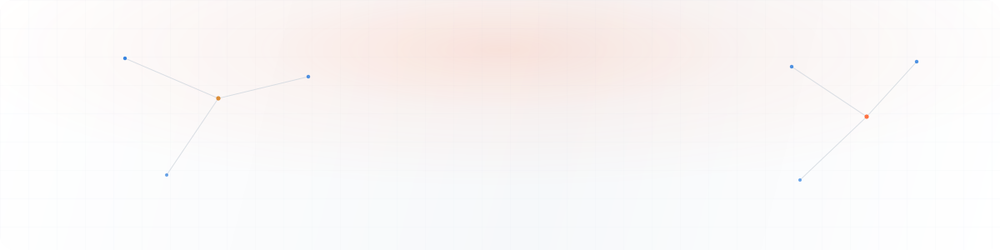
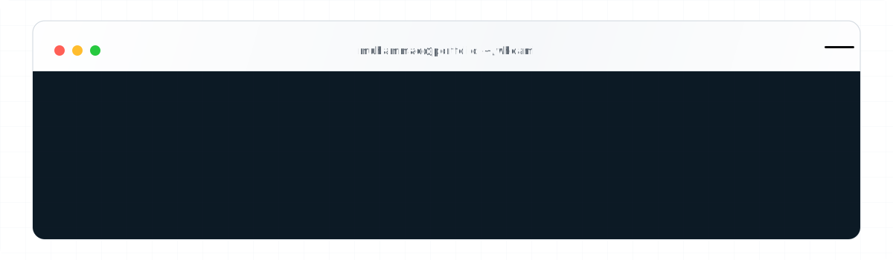
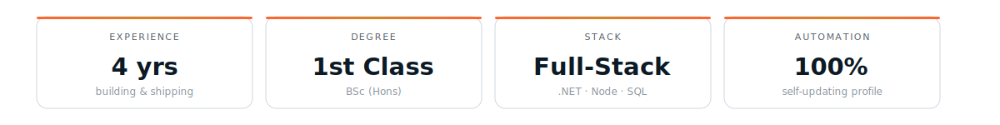
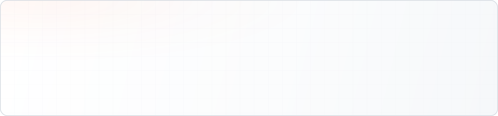
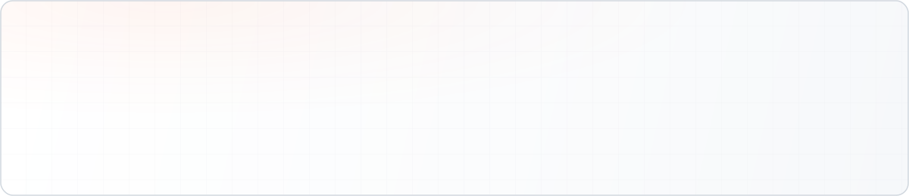
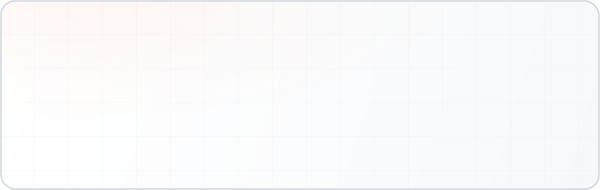
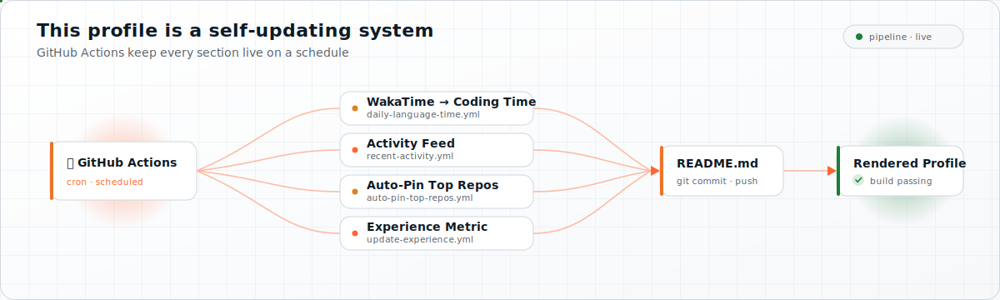
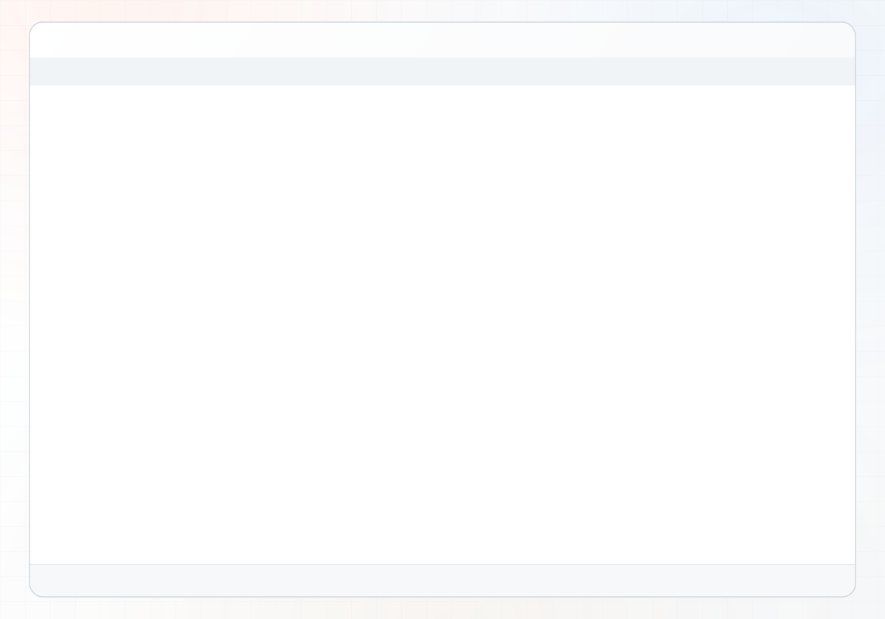

<!-- ════════════════════════════════════════════════════════════════════════
     MUHAMMAD ABDULLAH · github.com/MA1002643 · profile README
     "Engineering Mission-Control" — bespoke animated SVGs live in /assets
     ⚠ Auto-maintained blocks (DO NOT remove the marker comments):
        PINNED · RECENT_ACTIVITY · LANG-TIME
═════════════════════════════════════════════════════════════════════════ -->

<!-- ═══════════════════════════ HERO ═══════════════════════════ -->
<a name="hero"><picture><source media="(prefers-color-scheme: dark)" srcset="./assets/hero-pro-dark.svg"></picture></a>

<!-- ═══════════════════════ IDENTITY / CONTACT ═══════════════════════ -->

  
  
  
  
  

  
  
  
  

<!-- divider -->
<picture><source media="(prefers-color-scheme: dark)" srcset="./assets/divider-dark.svg"></picture>

<!-- ═══════════════════════ WHOAMI (terminal) ═══════════════════════ -->
<h2 align="center">🧑‍💻 <code>whoami</code></h2>

<picture>
  <source media="(prefers-color-scheme: dark)" srcset="./assets/terminal-card-dark.svg">
  
</picture>

<!-- ═══════════════════════ METRICS STRIP ═══════════════════════ -->
<picture>
  <source media="(prefers-color-scheme: dark)" srcset="./assets/metrics-strip-dark.svg">
  
</picture>

<!-- divider -->
<picture><source media="(prefers-color-scheme: dark)" srcset="./assets/divider-dark.svg"></picture>

<!-- ═══════════════════════ CORE STACK ═══════════════════════ -->
<h2 align="center">🧰 Core Stack</h2>

<picture><source media="(prefers-color-scheme: dark)" srcset="./assets/core-stack-dark.svg"></picture>

<!-- divider -->
<picture><source media="(prefers-color-scheme: dark)" srcset="./assets/divider-dark.svg"></picture>

<!-- ═══════════════════════ FEATURED PROJECTS ═══════════════════════ -->
<h2 align="center">🚀 Featured Project</h2>

<i>The project that best represents how I work — built end to end, documented, and tested.</i>

<a href="https://github.com/MA1002643/ai-powered-recipe-search-platform"><picture><source media="(prefers-color-scheme: dark)" srcset="./assets/featured-card-dark.svg"></picture></a>

Browse <a href="https://github.com/MA1002643?tab=repositories">all repositories →</a> — several are early works in progress.

### 📌 Most Active Repositories

<i>Auto-pinned weekly by a GitHub Action, ranked by recent activity — so this always reflects what I'm building right now.</i>

<!-- PINNED: START -->

  <a href="https://github.com/MA1002643/theabdullahfolio"><picture><source media="(prefers-color-scheme: dark)" srcset="./assets/pinned-1-dark.svg"></picture></a>
  <a href="https://github.com/MA1002643/article-server-full-stack-blogging-platform"><picture><source media="(prefers-color-scheme: dark)" srcset="./assets/pinned-2-dark.svg"></picture></a>

<!-- PINNED: END -->

<!-- divider -->
<picture><source media="(prefers-color-scheme: dark)" srcset="./assets/divider-dark.svg"></picture>

<!-- ═══════════════════════ LIVING SYSTEM (pipeline) ═══════════════════════ -->
<h2 align="center">⚙️ This Profile Is a Living System</h2>

Nothing below is maintained by hand. Scheduled GitHub Actions pull live data from the GitHub &amp; WakaTime APIs, regenerate every section — card artwork included — and commit the results back to this README. The CI/CD and automation in the stack above aren't bullet points; they're running in front of you. The profile <i>is</i> the demo.

<picture>
  <source media="(prefers-color-scheme: dark)" srcset="./assets/pipeline-dark.svg">
  
</picture>

<picture><source media="(prefers-color-scheme: dark)" srcset="./assets/ops-board-dark.svg"></picture>

### 🕒 Recent GitHub Activity

<i>And here is that pipeline's freshest output — a live event stream, re-rendered as bespoke SVG artwork from the GitHub API every morning by the <code>recent-activity</code> workflow.</i>

<!--RECENT_ACTIVITY:start-->

  <picture>
    <source media="(prefers-color-scheme: dark)" srcset="./assets/activity-feed-dark.svg">
    
  </picture>

<!--RECENT_ACTIVITY:end-->

<!-- divider -->
<picture><source media="(prefers-color-scheme: dark)" srcset="./assets/divider-dark.svg"></picture>

<!-- ═══════════════════════ GITHUB ANALYTICS ═══════════════════════ -->

<b>📊 GitHub Analytics</b>

 

  <picture>
    <source media="(prefers-color-scheme: dark)" srcset="https://github-readme-stats-chi-woad.vercel.app/api?username=MA1002643&show_icons=true&hide_border=false&title_color=ff652f&icon_color=FFC857&bg_color=0D1117&text_color=E5E7EB&border_color=243042&cache_seconds=7200" />
    
  </picture>
  <picture>
    <source media="(prefers-color-scheme: dark)" srcset="https://github-readme-streak-stats.herokuapp.com/?user=MA1002643&hide_border=false&background=0D1117&border=243042&ring=ff652f&fire=FFC857&currStreakNum=E5E7EB&currStreakLabel=E5E7EB&sideNums=E5E7EB&sideLabels=E5E7EB&dates=9CA3AF" />
    
  </picture>

  <picture>
    <source media="(prefers-color-scheme: dark)" srcset="https://github-readme-activity-graph.vercel.app/graph?username=MA1002643&bg_color=0D1117&color=E5E7EB&line=FF652F&point=FFC857&area=true&area_color=FF652F&hide_border=false&border_color=243042&custom_title=Contribution%20Graph" />
    
  </picture>

<b>📈 Most Used Languages &amp; Daily Coding Time</b>

 

<!-- Both cards live in ONE inline row (no blank lines between them):
     side by side on desktop, wrapping into a stack on narrow screens. -->

  <picture>
    <source media="(prefers-color-scheme: dark)" srcset="https://github-readme-stats-chi-woad.vercel.app/api/top-langs?username=MA1002643&layout=compact&langs_count=10&size_weight=0.5&count_weight=0.5&custom_title=Most%20Used%20Languages&bg_color=0D1117&title_color=ff652f&text_color=E5E7EB&border_color=243042&hide_border=false&cache_seconds=7200" />
    
  </picture>
  <!-- LANG-TIME:START -->
  <picture><source media="(prefers-color-scheme: dark)" srcset="./assets/lang-time-dark.svg"></picture>
  <!-- LANG-TIME:END -->

<b>Note:</b> Top languages reflect the makeup of my public code, not experience or skill level. Coding time is tracked by WakaTime and re-rendered daily by a GitHub Action.

<!-- divider -->
<picture><source media="(prefers-color-scheme: dark)" srcset="./assets/divider-dark.svg"></picture>

<!-- ═══════════════════════ BEYOND THE CODE (personality, tucked away) ═══════════════════════ -->

<b>🌃 Beyond the Code</b> — the human behind the commits

 

<picture>
  <source media="(prefers-color-scheme: dark)" srcset="./assets/beyond-code-dark.svg">
  
</picture>

> 🤝 Open to collaborating with juniors and seniors alike — and to contributing more to open source.

<!-- ═══════════════════════ FOOTER ═══════════════════════ -->
<picture>
  <source media="(prefers-color-scheme: dark)" srcset="./assets/divider-dark.svg">
  
</picture>

<i>If you've read this far, thank you. A ⭐ on a project that interested you helps others find it — and if you're building something ambitious, I'd welcome the conversation.</i>

